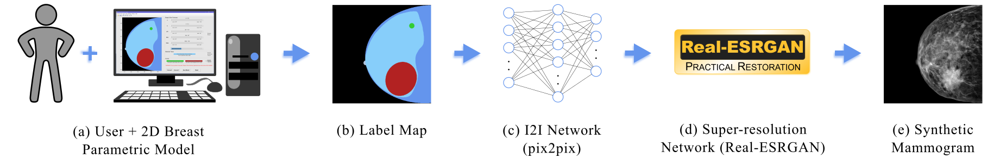

# CC-Mammograms-Generation_GUI
### [Project Page](https://github.com/cnr-isti-vclab/CC-Mammograms-Generation_GUI) | [Paper]() | [Bibtex](#bibtex)

Valentina Piras $^{1,3}$, Amedeo F. Bonatti $^{2}$, Carmelo De Maria $^{2}$, Paolo Cignoni $^3$, Francesco Banterle $^3$.<br>
$^1$ Department of Computer Science of the University of Pisa, $^2$ Department of Information Engineering and Research Center E. Piaggio of the University of Pisa, $^3$ Italian National Research Council of Pisa.



**Summary**

Breast cancer is the leading cause of cancer death in women worldwide, emphasizing the need for prevention and early detection. Mammography screening plays a crucial role in secondary prevention, but large datasets of referred mammograms from hospital databases are hard to access due to privacy concerns, and publicly available datasets are often unreliable and unbalanced. We propose a novel workflow using a statistical generative model based on generative adversarial networks to generate high-resolution synthetic mammograms. Utilizing a unique 2D parametric model of the compressed breast in craniocaudal projection and image-to-image translation techniques, our approach allows full and precise control over breast features and the generation of both normal and tumor cases.

The proposed workflow generates realistic synthetic mammograms with fine-tuned features. Synthetic mammograms are powerful tools that can create new or balance existing datasets, allowing for the training of machine learning and deep learning algorithms. These algorithms can then assist radiologists in tasks like classification and segmentation, improving diagnostic performance.

## Table of Contents
* [Requirements](#requirements)
* [Breast Profile Parameters Extraction](#breast-profile-parameters-extraction)
* [2D Parametric Breast Model](#2D-parametric-breast-model)
* [Citation](#citation)

## Requirements
- MATLAB 2023a
- Requirements for [pix2pix](https://github.com/phillipi/pix2pix)
- Requirements for [real-ESRGAN](https://github.com/xinntao/Real-ESRGAN)

## Usage
In this repository, you will find the code related to the 2D parametric breast model, including the extraction of breast profile parameters and our GUI. Additionally, in each folder, the user will find a README file that explains how to use the functions contained within the folder. For the subsequent steps, please refer to the following repositories and to our [paper]():
- Low-resolution mammograms generation: [pix2pix](https://github.com/phillipi/pix2pix)
- High-resolution mammograms generation: [real-ESRGAN](https://github.com/xinntao/Real-ESRGAN)

## Breast Profile Parameters Extraction
In the corresponding folder, you will find the functions we used to extract breast shape parameters from the mammograms in our Selected Dataset, i.e. 163 CC mammograms selected from the [Categorized Digital Database for Low energy and Subtracted Contrast Enhanced Spectral Mammography images (CDD-CESM)](https://www.cancerimagingarchive.net/collection/cdd-cesm/) publicly available in the [Cancer Imaging Archive](https://www.cancerimagingarchive.net/). We created four separate functions, each corresponding to a different category of mammograms: normal, with benign findings, with malignant findings, and with both benign and malignant findings. 

If you have your own dataset of CC mammograms, you can also process all the categories together, but please ensure that your folder structure is organized as follows:

```
<your_CC_mammogram_dataset>
|---right_breast_mammograms
|   |---<right_0001>
|   |---<right_0002>
|   |---...
|---left_breast_mammograms
|   |---<left_0001>
|   |---<left_0002>
|   |---...
```

## 2D Parametric Breast Model
In the corresponding folder, the user can find the code to run in order to launch the GUI with the parametric breast model, as well as a PDF tutorial on how to use it for creating the labels.


<a name="bibtex"></a>
## Citation


